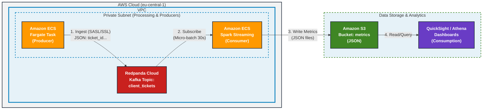

------

# Projet 9 - Exercice 2 : POC Pipeline ETL Temps Réel (Redpanda & Spark Streaming)

Ce projet est une Preuve de Concept (POC) d'un pipeline ETL (Extract, Transform, Load) en temps réel. Il simule l'ingestion de tickets de support client, les traite en continu pour enrichir les données et calculer des agrégations complexes, et stocke les métriques résultantes sous format JSON, simulant un chargement vers un Data Lake (S3).

## 📑 Vue d'ensemble

Le but de ce pipeline est de transformer un flux brut d'événements (tickets de support) en métriques exploitables pour l'analyse métier (BI), avec une latence faible (micro-batchs de 30 secondes).

### Technologies clés

- **Docker & Docker Compose :** Orchestration des conteneurs pour un déploiement facile.
- **Python (Faker & Confluent Kafka) :** Génération de données synthétiques et production vers le bus d'événements.
- **Redpanda Cloud :** Plateforme de streaming d'événements compatible Kafka (utilisée ici en mode SaaS).
- **PySpark Structured Streaming :** Moteur de traitement de données en temps réel pour le nettoyage, l'enrichissement et l'agrégation.

## 🏗️ Architecture

L'architecture, conçue pour être déployée sur AWS (ECS Fargate, S3), est simulée localement via Docker Compose.

*(Note : L'implémentation actuelle dépose les fichiers JSON localement, simulant l'étape "Write Metrics" vers S3).*

**Flux de données :**

1. **Producteur (Ingest) :** Un script Python génère des tickets de support aléatoires (JSON) et les envoie de manière sécurisée (SASL/SSL) vers un topic `client_tickets` sur Redpanda Cloud.
2. **Hub de Streaming :** Redpanda Cloud reçoit et met en mémoire tampon les messages.
3. **Consommateur & Traitement (Subscribe & Process) :**
   - Spark Structured Streaming s'abonne au topic Redpanda.
   - Toutes les **30 secondes** (trigger micro-batch), Spark traite les nouvelles données.
   - **Transformations :** Conversion de timestamps, extraction de date/heure, mapping des équipes de support, calcul des SLA (Service Level Agreement) et scoring de priorité.
   - **Agrégations :** Calcul de métriques complexes (total, par heure, par jour, par type, par équipe, moyennes/médianes des SLA, etc.).
4. **Stockage (Write) :** À la fin de chaque micro-batch, un fichier JSON contenant toutes les métriques agrégées est écrit dans un volume local partagé.




## 📂 Structure du Projet

Bash

```
.
├── docker-compose.yml       # Orchestration des services Producer et Spark
├── Pipeline Diagram.png     # Diagramme visuel de l'architecture
├── producer/                # Dossier du conteneur Producteur
│   ├── Dockerfile           # Définition de l'image Docker du producteur
│   ├── producer_redpanda.py # Script Python de génération et d'envoi des tickets
│   └── requirements.txt     # Dépendances Python (confluent-kafka, faker)
└── spark/                   # Dossier du conteneur Spark
    ├── Dockerfile           # Définition de l'image Docker Spark (avec connecteurs Kafka)
    ├── traitement_spark.py  # Script PySpark de streaming et d'agrégation
    └── ticket_metrics_json/ # DOSSIER DE SORTIE : contient les fichiers JSON générés
```

## 🚀 Installation et Utilisation (Docker Compose)

### Prérequis

- Docker et Docker Compose installés sur votre machine.
- Une connexion Internet active (les conteneurs doivent se connecter à Redpanda Cloud externe).

### Instructions de démarrage

1. **Cloner ou télécharger** ce dépôt sur votre machine.

2. **Ouvrir un terminal** à la racine du projet (là où se trouve `docker-compose.yml`).

3. **Construire les images Docker :**

   Bash

   ```
   docker-compose build
   ```

4. **Démarrer le pipeline :**

   Bash

   ```
   docker-compose up
   ```

> **Note sur le démarrage :** Le service `producer` est configuré pour attendre que le service `spark` soit "healthy" (opérationnel et capable de se connecter à Redpanda) avant de démarrer. Il est normal de voir des logs d'attente au début.

Pour arrêter le pipeline proprement : Faites `CTRL+C` dans le terminal, puis exécutez `docker-compose down`.

## ✅ Preuve de Fonctionnalité

Comment vérifier que le pipeline fonctionne correctement ?

### 1. Vérification des Logs (Terminal)

- **Logs du Producteur (`ticket_producer`) :** Vous verrez des messages indiquant l'envoi de tickets en continu.

  Plaintext

  ```
  ticket_producer | Produced: {'ticket_id': '...', 'priority': 'high', ...}
  ticket_producer | 📨 Delivered to client_tickets [0] @ offset 12345
  ```

- **Logs de Spark (`spark_stream_processor`) :** Toutes les 30 secondes, vous verrez le démarrage d'un micro-batch et la confirmation de l'écriture du fichier JSON.

  Plaintext

  ```
  spark_stream_processor | ...
  spark_stream_processor | [✓] JSON metrics written → /tmp/ticket_metrics_json/batch_00042.json
  ```

### 2. Vérification des Sorties (Fichiers JSON)

La preuve ultime du fonctionnement est la génération des fichiers de métriques.

1. Pendant que le pipeline tourne, naviguez dans votre explorateur de fichiers vers le dossier du projet : `spark/ticket_metrics_json/`.
2. Vous verrez apparaître de nouveaux fichiers `batch_XXXXX.json` toutes les ~30 secondes.
3. **Ouvrez un de ces fichiers.** Il contiendra la structure agrégée définie dans le script Spark, par exemple :

JSON

```
{
    "batch_id": 42,
    "total_tickets": 150,
    "tickets_per_hour": [
        {"hour": 10, "tickets_per_hour": 45},
        {"hour": 11, "tickets_per_hour": 105}
    ],
    "by_team": [
        {"support_team": "Security Ops Center", "count_by_support_team": 12},
        {"support_team": "Team Tech 1", "count_by_support_team": 80}
        // ... autres équipes
    ],
    "sla_mean": 24.5,
    "sla_median": 4.0,
    "priority_score_mean": 2.8,
    // ... autres métriques
}
```

La présence et le contenu de ces fichiers confirment que les données sont ingérées, transformées, agrégées et stockées avec succès.